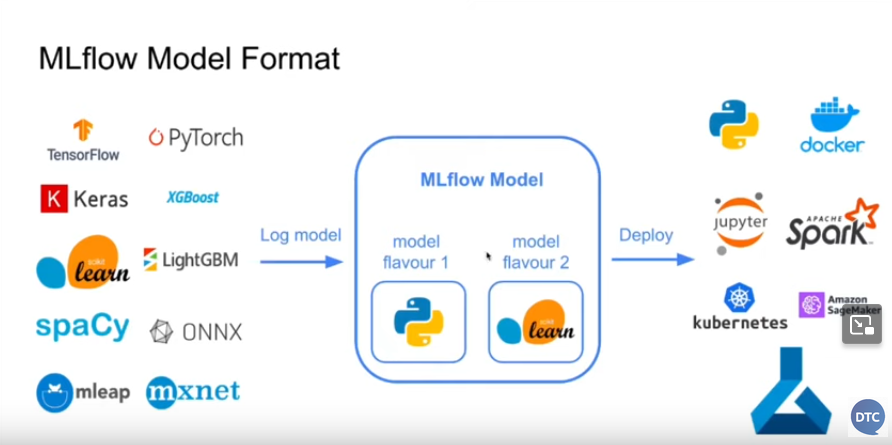

# Experiment tracking

Experiment tracking is the process of keeping track of all the relevant information from an ML experiment (e.g. hyperparameters, metrics, data, code, etc.).

#### Motivations for experiment tracking include:
- Reproducibility: being able to reproduce the results of an experiment
- Organization: keeping track of all the relevant information from an experiment
- Optimization: being able to optimize the hyperparameters of a model

## MLflow

"Open source platform for the machine learning lifecycle"

In practice, it is a python package that contains four main modules:
- Tracking: logging and querying experiments
- Models: managing and deploying models
- Model Registry: managing and versioning models
- Projects: packaging ML code in a reusable and reproducible way

### Tracking module

The tracking module is used to log and query experiments. It is composed of two main components:
- MLflow server: backend server that stores the data
- MLflow client: python package that interacts with the server

The module allows to organize experiments in runs, which are the individual executions of an experiment. Each run can contain the following information:
- Parameters: hyperparameters of the model
- Metrics: evaluation metrics of the model
- Tags: additional information about the run
- Artifacts: files generated during the run (e.g. model weights, plots, etc.)
- Model: the model itself

It also logs extra information such as the code that generated the run, the git commit, the environment, etc.

### Running the MLflow server

To avoid issues with the backend use the following command:
```
mlflow ui --backend-store-uri sqlite:///mlflow.db
```

### Basic functionalities

```python
with mlflow.start_run():

    mlflow.set_tag("developer", "arnaud") # Log tags

    alpha = 0.1
    mlflow.log_param("alpha", alpha) # Log all kind of parameter
    mlflow.log_param("train-data-path", "./data/green_tripdata_2021-01.parquet")
    mlflow.log_param("valid-data-path", "./data/green_tripdata_2021-02.parquet")

    lr = Lasso(alpha)
    lr.fit(X_train, y_train)

    y_pred = lr.predict(X_val)
    
    rmse = root_mean_squared_error(y_val, y_pred)
    
    mlflow.log_metric("rmse", rmse) # Log metrics

    # Log artifacts i.e. files associated to the experiment (model, data..)
    mlflow.log_artifact(local_path="models/lin_reg.bin", artifact_path="models_pickle")
```

#### Autolog

Autolog logs a number of parameters, to which you can add others. It is implemented for the calssic models packages such as scikit-learn or Pytorch

#### Log your model

Two options:
- Log model as an artifact: `mlflow.log_artifact("mymodel", artifact_path="models/")`
- Log model using the method `log_model` not available for everything: `mlflow.<framework>.log_model(model, artifact_path="models/")`



### Model Registry

The Model registry is a centralized model store for production-ready models, with a UI and a set of APIs to manage the lifecycle of models
It provides
- Model lineage
- Model versioning
- Stage transitions
- Annotations

`MLFlowClient` Class that allows to
- Create and manage experiments and runs
- create and manage registered models and model versions

```
from mlflow.client import MlflowClient
MLFLOW_TRACKING_URI = "sqlite:///mlflow.db"

client = MlflowClient(tracking_uri=MLFLOW_TRACKING_URI)
```

### MLflow Server

The MLflow server is a backend server that stores the data. It can be run locally or remotely.

```
mlflow server --backend-store-uri sqlite:///mlflow.db
